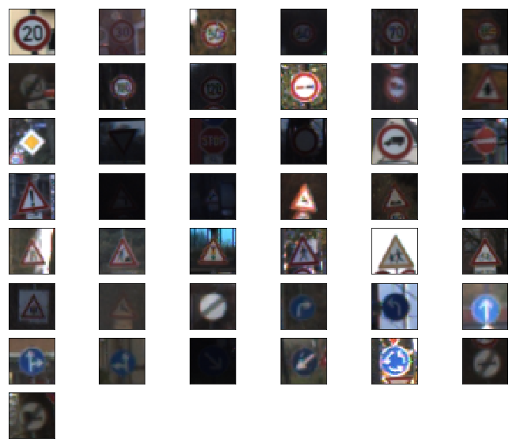
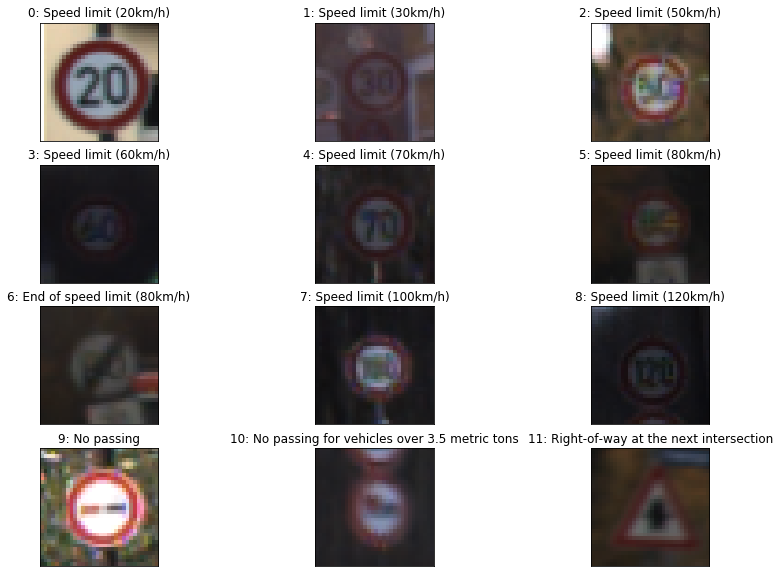
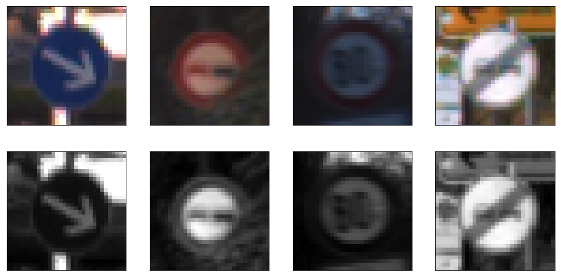
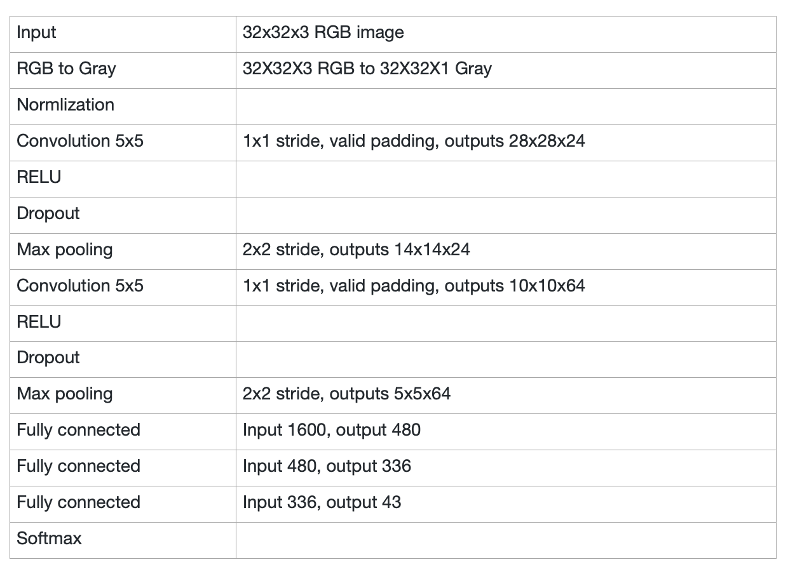
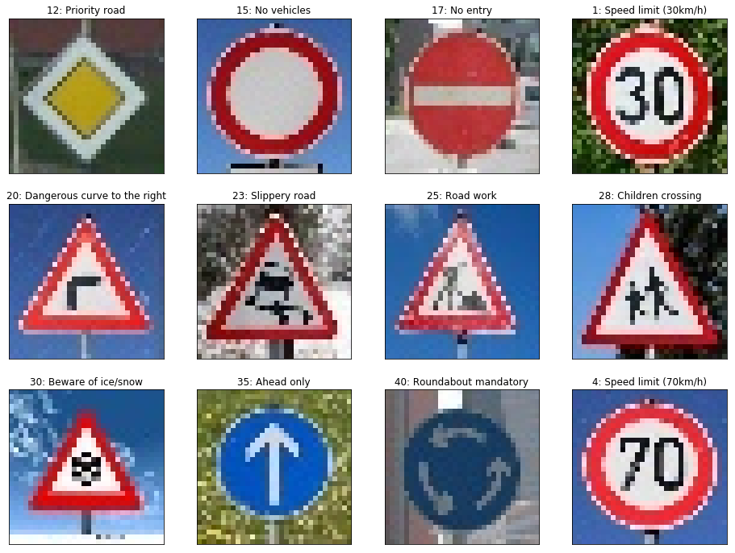
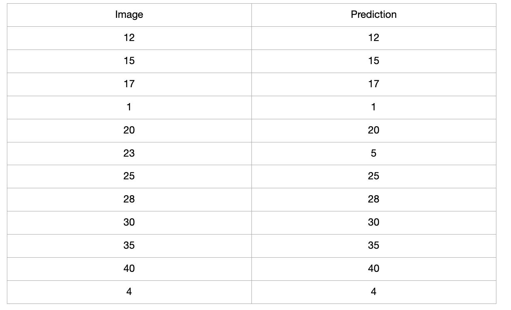
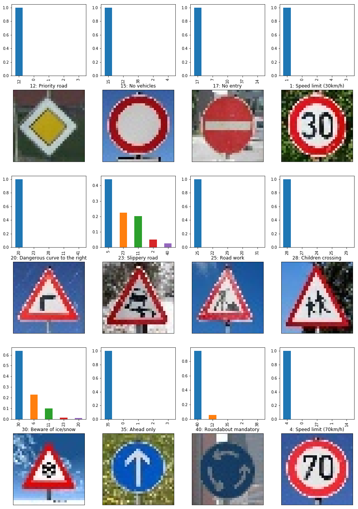

## Project: Build a Traffic Sign Recognition Program

In this project, you will use what you've learned about deep neural networks and convolutional neural networks to classify traffic signs. You will train and validate a model so it can classify traffic sign images using the [German Traffic Sign Dataset](http://benchmark.ini.rub.de/?section=gtsrb&subsection=dataset). After the model is trained, you will then try out your model on images of German traffic signs that you find on the web.

## The goals / steps of this project are the following:

* Load the data set (see below for links to the project data set) * Explore, summarize and visualize the data set
* Design, train and test a model architecture
* Use the model to make predictions on new images
* Analyze the softmax probabilities of the new images
* Summarize the results with a written report

## Data Set Summary & Exploration

## 1. Summary of the data set.

The information of the traffic signs data set:

* Number of training examples = 34799 * Number of validation examples = 4410 * Number of testing examples = 12630
* Image data shape = (32, 32)
* Number of classes = 43

## 2. Exploratory visualization of the dataset.

Here is an exploratory visualization of the data set. In following figure shows the images of the 43 kinds of traffic signs. 12 traffic sign images are shown as example with labels in the second figure.

In following figure, the count of each sign in train data is plotted.

## Design and Test a Model Architecture

## 1. Preprocess of data.

As a first step, I decided to convert the images to grayscale because according to the paper "Traffic Sign Recognition with Multi-Scale Convolutional Networks", one gray image work better than color one. In following figure is an example of a traffic sign image before and after grayscaling. After color transformation, the data is normalized, because the normalized data could benifit the model training.

3 kinds of methods are applied to augment the training data, namely, the rotating, translation and scaling. In following figure is an example of an original images and the generated images: the first row is oringal image, the second row is rotated image, the third row is tranlated iamge, the fourth row is 90% scaled image, the fifth row is 110% scaled image. By adding faked training data the training performance will be improved. In my case the test accuracy is improved from 95.1% to 96.8%.

## 2. Model architecture

My final model consisted of the following layers:

## 3. Model training.

To train a better model, I adjust these parameters:

1. the regulization loss constant (0 default). 0.01 is OK for the model, this make the traing process more smooth. If the it is 0, there will be accuracy joggle.

2. dropout at convolution layer(1.0 default). Dropout at convolution layer keep_prob_conv_input, this is no big difference when change this in training, so it is kept to 1.0 in my case.

3. dropout at the fullyconnect layer (1.0 default). Droput at fully connenct layer keep_prob_fc_input set at 0.5 will improve the test accucy and will also avoid overfitting the training data.

4. training Epoch is set as 10. More Epoch will not increase the test accurcy.

5. batch_size is set as 128, the Epoch and batch_size work well in this case. When the training data is expanded to 5 times, the test accuracy is improved about 2%.

## 4. Final model results.

The final model results are:

* training set accuracy of 0.999.
* validation set accuracy of 0.984.
* test set accuracy of 0.968.

## Test a Model on New Images

## 1. Choose test data

Here are 12 German traffic signs that are found on the web. The sixth and the ninth image might be difficult to classify because the symbol in the middle is difficult to recognize after the image resize to 32*32.

## 2. Test results.

The results of the prediction is given in following table:

The model was able to correctly guess 11 of the 12 traffic signs, which gives an accuracy of 91.67%.

## 3. Softmax probabilities analysis

The model can make a good prodiction for most of the image, in following figure, it shows the sixth sign 23 is false predicted to sign 5. 10 of the 12 images are predicted with probability greater than 0.8.

